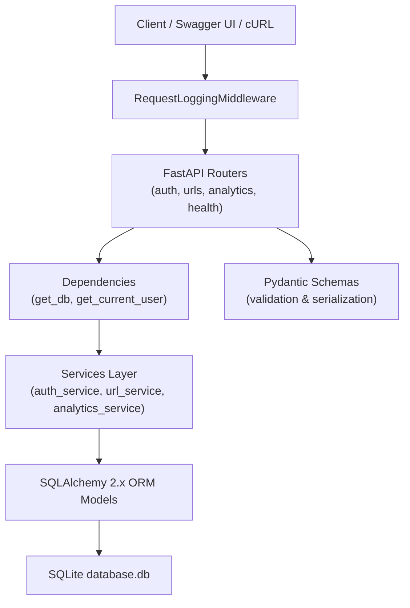
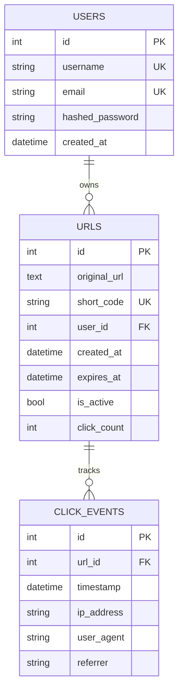
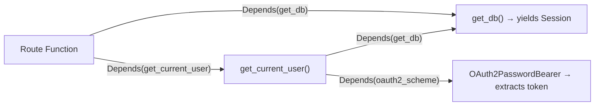

# SmartURL — Complete Project Deep-Dive

## 1. The Core Concept

SmartURL is a **RESTful URL Shortening API** — a backend service that takes a long URL like `https://www.example.com/articles/python/fastapi/tutorial` and converts it into a short, unique code like `http://localhost:8000/aB92xK`. When anyone visits that short link, the server **redirects** them (HTTP 307) to the original destination while **recording analytics** (who clicked, when, from where).

The project is an **academic-grade, production-patterned** application — built to demonstrate how real-world Python APIs are architected, secured, tested, and documented.

---

## 2. Technology Stack — Why Each Choice

| Technology | Role | Why It Was Chosen |
|---|---|---|
| **Python 3.12+** | Language | Modern, readable, strong type-hinting support |
| **FastAPI** | Web Framework | Async-ready, auto-generates OpenAPI docs, built-in dependency injection, Pydantic-native validation |
| **Uvicorn** | ASGI Server | High-performance async server for FastAPI (ASGI = Asynchronous Server Gateway Interface) |
| **Pydantic v2** | Validation & Serialization | Validates all incoming JSON, enforces schemas, serializes outgoing responses |
| **pydantic-settings** | Configuration | Loads `.env` file → typed Python settings object |
| **SQLAlchemy 2.x** | ORM (Object-Relational Mapping) | Maps Python classes to database tables; uses modern `Mapped[]` / `select()` syntax |
| **SQLite 3** | Database Engine | Zero-config embedded database, perfect for local/academic use |
| **pwdlib (Argon2)** | Password Hashing | Argon2 is the winner of the 2015 Password Hashing Competition — memory-hard, GPU-resistant |
| **PyJWT** | Token Security | Encodes/decodes JSON Web Tokens (JWTs) for stateless auth |
| **pytest** | Testing | Industry-standard Python test framework with fixtures and assertions |
| **HTTPX / TestClient** | HTTP Testing | FastAPI's built-in test client for simulating API requests |
| **python-multipart** | Form Parsing | Required by FastAPI for OAuth2 `application/x-www-form-urlencoded` login form |
| **email-validator** | Email Validation | Validates email format in Pydantic `EmailStr` fields |

---

## 3. Architecture — Layered Design

SmartURL follows a **clean layered architecture** where each layer has a single responsibility and only talks to the layer directly below it:



### Why Layers Matter

- **Routers** handle HTTP concerns only (status codes, request/response formats) — they never touch the database directly.
- **Services** contain all business logic (password hashing, short code generation, expiration checks) — they are framework-agnostic and testable in isolation.
- **Models** define the database schema in Python — SQLAlchemy translates them to SQL `CREATE TABLE` statements automatically.
- **Schemas** (Pydantic) ensure data integrity at the API boundary — invalid data is rejected with `422 Unprocessable Entity` before it ever reaches business logic.

---

## 4. How the Application Boots

When you run `python -m uvicorn app.main:app --reload`, this is the exact startup sequence:

### Step 1 — Configuration Loads ([config.py](file:///d:/user%20(sarthak)/projects/smarturl/app/core/config.py))

```python
class Settings(BaseSettings):
    PROJECT_NAME: str = "SmartURL API"
    SECRET_KEY: str = "..."          # JWT signing key
    ALGORITHM: str = "HS256"          # JWT algorithm
    ACCESS_TOKEN_EXPIRE_MINUTES: int = 30
    DATABASE_URL: str = "sqlite:///./database.db"
    
    model_config = SettingsConfigDict(env_file=".env")
```

`pydantic-settings` reads your `.env` file and populates a typed `Settings` object. Every config value has a default, so the app works even without a `.env` — but in production you'd override `SECRET_KEY`.

### Step 2 — Database Engine Created ([database.py](file:///d:/user%20(sarthak)/projects/smarturl/app/database/database.py))

```python
engine = create_engine(settings.DATABASE_URL, connect_args={"check_same_thread": False})
SessionLocal = sessionmaker(autocommit=False, autoflush=False, bind=engine)

class Base(DeclarativeBase):
    pass
```

- `create_engine` establishes the connection string to SQLite.
- `check_same_thread=False` is required because SQLite is single-threaded by default, but Uvicorn uses thread pools.
- `SessionLocal` is a factory that creates new database sessions — one per request.
- `Base` is the declarative base that all ORM models inherit from.

### Step 3 — FastAPI App Initializes with Lifespan ([main.py](file:///d:/user%20(sarthak)/projects/smarturl/app/main.py))

```python
@asynccontextmanager
async def lifespan(app: FastAPI):
    Base.metadata.create_all(bind=engine)  # Create all tables
    yield                                   # App runs
    # (cleanup would go here)

app = FastAPI(title=settings.PROJECT_NAME, lifespan=lifespan)
```

The `lifespan` context manager runs `create_all()` **once at startup** — this inspects all models that inherit from `Base` and creates any missing tables in `database.db`. This is a modern replacement for FastAPI's deprecated `@app.on_event("startup")`.

### Step 4 — Middleware & Routers Registered

```python
app.add_middleware(RequestLoggingMiddleware)      # Logs every request
app.include_router(auth.router, prefix="/api/v1") # /api/v1/auth/*
app.include_router(urls.router, prefix="/api/v1") # /api/v1/urls/*
app.include_router(analytics.router, prefix="/api/v1") # /api/v1/analytics/*
app.include_router(urls.redirect_router)          # /{short_code} (no prefix)
```

Two separate routers exist in [urls.py](file:///d:/user%20(sarthak)/projects/smarturl/app/routers/urls.py):
- `router` — authenticated management endpoints under `/api/v1/urls`
- `redirect_router` — the public `GET /{short_code}` endpoint at the root

---

## 5. Database Schema — Three Tables, Three Relationships

Defined in [models.py](file:///d:/user%20(sarthak)/projects/smarturl/app/database/models.py):



### Key Design Decisions

1. **`click_count` on `urls` table** — This is a **denormalized counter** for fast aggregation. Instead of running `SELECT COUNT(*) FROM click_events WHERE url_id = X` on every request, the service increments `click_count` atomically. This is a common performance optimization in analytics systems.

2. **`click_events` table** — Stores the **detailed per-click log** (IP, User-Agent, Referrer, timestamp). This enables detailed analytics while `click_count` handles the summary.

3. **`cascade="all, delete-orphan"`** — When a User is deleted, all their URLs are automatically deleted. When a URL is deleted, all its ClickEvents are deleted. This prevents orphaned records.

4. **Modern SQLAlchemy 2.x syntax** — Uses `Mapped[int]`, `mapped_column()`, and `select()` instead of the legacy `Column()`, `db.query()` pattern.

---

## 6. The Complete Request Lifecycle — A Deep Trace

### Flow A: User Registers → Logs In → Creates Short URL → Someone Clicks It → Owner Views Analytics

---

#### Step 1: Registration — `POST /api/v1/auth/register`

**Router** ([routers/auth.py](file:///d:/user%20(sarthak)/projects/smarturl/app/routers/auth.py)):
```
Client sends: {"username": "sarthak", "email": "sarthak@example.com", "password": "StrongPassword123"}
```

1. **Pydantic validates** the JSON body against [`UserRegister`](file:///d:/user%20(sarthak)/projects/smarturl/app/schemas/auth.py) schema:
   - `username`: 3-50 chars ✓
   - `email`: valid email format (via `email-validator`) ✓
   - `password`: min 8 chars ✓

2. **`get_db()` dependency** injects a fresh `Session` (opens a DB connection).

3. **[`register_user()`](file:///d:/user%20(sarthak)/projects/smarturl/app/services/auth_service.py)** service is called:
   - Checks if `username` already exists → `409 Conflict` if duplicate
   - Checks if `email` already exists → `409 Conflict` if duplicate
   - Hashes password with **Argon2**: `password_hash.hash("StrongPassword123")` → `$argon2id$v=19$m=65536,t=3,p=4$...`
   - Creates `User` ORM object, `db.add()`, `db.commit()`, `db.refresh()`

4. **Response**: `201 Created` with `UserResponse` (id, username, email, created_at — **never** the password hash)

---

#### Step 2: Login — `POST /api/v1/auth/login`

```
Client sends: username=sarthak&password=StrongPassword123 (form-encoded, NOT JSON)
```

1. **`OAuth2PasswordRequestForm`** is a FastAPI built-in that parses `application/x-www-form-urlencoded` form data — this follows the OAuth2 Resource Owner Password Credentials flow.

2. **[`authenticate_user()`](file:///d:/user%20(sarthak)/projects/smarturl/app/services/auth_service.py)** service:
   - Looks up user by username using `select(User).where(User.username == username)`
   - Verifies password: `password_hash.verify("StrongPassword123", stored_argon2_hash)` — Argon2 internally re-derives the hash with the stored salt and compares
   - Returns `User` object or `None`

3. **[`create_access_token()`](file:///d:/user%20(sarthak)/projects/smarturl/app/core/security.py)** generates a JWT:
   ```python
   payload = {
       "sub": "sarthak",                    # Subject (username)
       "exp": now + 30 minutes,              # Expiration
       "iat": now                             # Issued At
   }
   jwt.encode(payload, SECRET_KEY, algorithm="HS256")
   ```
   This produces a token like: `eyJhbGciOiJIUzI1NiIs...`

4. **Response**: `200 OK` with `{"access_token": "eyJ...", "token_type": "bearer"}`

---

#### Step 3: Create Short URL — `POST /api/v1/urls`

```
Client sends:
  Headers: Authorization: Bearer eyJ...
  Body: {"original_url": "https://www.example.com/very/long/path", "custom_alias": "my-link"}
```

1. **[`get_current_user()`](file:///d:/user%20(sarthak)/projects/smarturl/app/core/dependencies.py) dependency chain** runs:
   - `OAuth2PasswordBearer` extracts the token from the `Authorization: Bearer <token>` header
   - `decode_access_token()` decodes & validates the JWT (checks signature, expiration)
   - Extracts `sub` claim → `"sarthak"`
   - Queries DB for `User` with that username
   - Injects the `User` object into the route function

2. **Pydantic validates** against [`URLCreate`](file:///d:/user%20(sarthak)/projects/smarturl/app/schemas/url.py):
   - `@field_validator("original_url")` checks `http://` or `https://` prefix → rejects `ftp://`, `mailto:`, etc.
   - `@field_validator("custom_alias")` checks regex `^[a-zA-Z0-9_-]+$` → rejects spaces, special chars

3. **[`create_url()`](file:///d:/user%20(sarthak)/projects/smarturl/app/services/url_service.py)** service:
   - **Custom alias path**: Checks if `"my-link"` is already taken → `409` if duplicate → uses it as `short_code`
   - **Auto-generation path** (no alias): Uses `secrets.choice()` to generate 6 random characters from `a-zA-Z0-9` (62 possible chars per position = 62⁶ = **56.8 billion** possible codes). Retries up to 10 times if collision detected.
   - Creates `URL` object with `is_active=True`, `click_count=0`, commits to DB

4. **Response**: `201 Created` with full URL details including the generated `short_url` field (built in [`URLResponse.model_post_init()`](file:///d:/user%20(sarthak)/projects/smarturl/app/schemas/url.py#L73-L75))

---

#### Step 4: Public Redirect — `GET /my-link`

```
Any visitor accesses: http://localhost:8000/my-link (no authentication needed)
```

1. **No auth required** — this endpoint uses `redirect_router` without `get_current_user`

2. **[`process_url_redirect()`](file:///d:/user%20(sarthak)/projects/smarturl/app/services/url_service.py#L115-L142)** validates the short code:
   - Looks up `URL` by `short_code` → `404` if not found
   - Checks `is_active` → `410 Gone` if deactivated
   - Checks `expires_at` vs current UTC time → `410 Gone` if expired
   - Returns the `URL` object and `original_url`

3. **[`record_click_event()`](file:///d:/user%20(sarthak)/projects/smarturl/app/services/analytics_service.py)** captures analytics:
   - Extracts from the `Request` object: `client.host` (IP), `user-agent` header, `referer` header
   - Increments `url_obj.click_count += 1`
   - Creates a new `ClickEvent` row with all metadata
   - Commits both changes in a single transaction

4. **Response**: `307 Temporary Redirect` with `Location: https://www.example.com/very/long/path`

> [!NOTE]
> **Why 307 and not 301?** A `301 Permanent Redirect` tells browsers and search engines to cache the redirect forever — meaning future clicks would bypass SmartURL entirely and analytics would stop working. `307 Temporary Redirect` ensures every click passes through the server.

---

#### Step 5: View Analytics — `GET /api/v1/analytics/my-link`

1. **Auth + Ownership check**: `get_current_user` → verify `url_obj.user_id == current_user.id` → `403` if not owner

2. **[`get_url_analytics()`](file:///d:/user%20(sarthak)/projects/smarturl/app/services/analytics_service.py#L35-L64)**:
   - Queries last 10 `ClickEvent` rows ordered by `timestamp DESC`
   - Reads `click_count` from the URL object (the denormalized counter)
   - Extracts `last_clicked_at` from the most recent event
   - Serializes everything into `URLAnalyticsResponse`

3. **Response**:
   ```json
   {
     "short_code": "my-link",
     "total_clicks": 5,
     "last_clicked_at": "2026-09-10T00:30:00+00:00",
     "recent_clicks": [
       {
         "timestamp": "...",
         "ip_address": "127.0.0.1",
         "user_agent": "Mozilla/5.0...",
         "referrer": "https://google.com"
       }
     ]
   }
   ```

---

## 7. Security Architecture

### Password Security

```
User types: "StrongPassword123"
        ↓
pwdlib Argon2 hashing
        ↓
Stored: "$argon2id$v=19$m=65536,t=3,p=4$randomsalt$derivedhash"
```

- **Argon2id** is memory-hard — it deliberately uses ~64MB RAM per hash, making GPU/ASIC brute-force attacks economically infeasible.
- Each hash includes a **unique random salt**, so identical passwords produce different hashes.
- `pwdlib` with `.recommended()` uses the OWASP-recommended parameter set.

### JWT Token Security

```
Header:  {"alg": "HS256", "typ": "JWT"}
Payload: {"sub": "sarthak", "exp": 1694300000, "iat": 1694298200}
        ↓
HMAC-SHA256 signed with SECRET_KEY
        ↓
eyJhbGciOiJIUzI1NiIs.eyJzdWIiOiJzYXJ0aGFrIi.signature
```

- **Stateless**: The server doesn't store sessions — the JWT contains everything needed to identify the user.
- **Expiration**: Tokens expire after 30 minutes (configurable).
- **Tamper-proof**: Any modification to the payload invalidates the HMAC signature.

### Multi-Tenant Isolation

Every management endpoint (GET/PATCH/DELETE URL, GET analytics) checks:
```python
if url_obj.user_id != current_user.id:
    raise HTTPException(status_code=403, detail="Access forbidden: You do not own this URL")
```
User A can never manage or view analytics for User B's URLs.

---

## 8. Middleware — Cross-Cutting Concern

[`RequestLoggingMiddleware`](file:///d:/user%20(sarthak)/projects/smarturl/app/middleware/logging.py) wraps **every** request:

```python
async def dispatch(self, request, call_next):
    start_time = time.time()
    response = await call_next(request)
    process_time_ms = round((time.time() - start_time) * 1000, 2)
    logger.info(f"Method: {request.method} | Path: {request.url.path} | Status: {response.status_code} | Time: {process_time_ms}ms")
    return response
```

Output example:
```
2026-09-10 00:30:15 - smarturl.request - INFO - Method: GET | Path: /my-link | Status: 307 | Time: 12.45ms
```

This is an **ASGI middleware** pattern — it intercepts requests before they reach routers and responses before they leave the server.

---

## 9. FastAPI Dependency Injection — The Backbone

FastAPI's `Depends()` system is the architectural glue that makes the app clean and testable:



### `get_db()` — Database Session per Request
```python
def get_db():
    db = SessionLocal()
    try:
        yield db      # ← Injected into route function
    finally:
        db.close()    # ← Always runs, even if exceptions occur
```
Using `yield` makes this a **generator dependency** — FastAPI calls `next()` to get the session, and runs the `finally` block after the response is sent. This guarantees **no connection leaks**.

### `get_current_user()` — Security Context Extraction
This dependency itself depends on `get_db` AND `oauth2_scheme` — FastAPI resolves the entire dependency tree automatically. The result is that any route can get the authenticated user simply by declaring `current_user: User = Depends(get_current_user)`.

---

## 10. Pydantic v2 Validation — Detailed Breakdown

### Input Validation ([`URLCreate`](file:///d:/user%20(sarthak)/projects/smarturl/app/schemas/url.py#L7-L43))

```python
@field_validator("original_url")
@classmethod
def validate_original_url(cls, v: str) -> str:
    v_stripped = v.strip()
    if not (v_stripped.startswith("http://") or v_stripped.startswith("https://")):
        raise ValueError("URL must start with http:// or https://")
    return v_stripped
```

This rejects `ftp://`, `mailto:`, `javascript:`, etc. — only HTTP/HTTPS URLs are allowed.

### Output Serialization ([`URLResponse`](file:///d:/user%20(sarthak)/projects/smarturl/app/schemas/url.py#L60-L83))

```python
class URLResponse(BaseModel):
    model_config = ConfigDict(from_attributes=True)  # Read from SQLAlchemy objects

    def model_post_init(self, __context):
        if not self.short_url and self.short_code:
            self.short_url = f"http://127.0.0.1:8000/{self.short_code}"  # Auto-compute full URL

    @field_serializer("created_at", "expires_at")
    def serialize_datetimes(self, dt):
        # Ensure timezone-aware ISO 8601 output
```

- `from_attributes=True` tells Pydantic to read fields from SQLAlchemy model attributes (not just dict keys).
- `model_post_init` computes the `short_url` field dynamically — it's not stored in the database.
- `field_serializer` ensures consistent ISO 8601 datetime formatting in JSON responses.

---

## 11. URL Short Code Generation — The Algorithm

From [`url_service.py`](file:///d:/user%20(sarthak)/projects/smarturl/app/services/url_service.py#L15-L17):

```python
ALPHABET = string.ascii_letters + string.digits  # a-z A-Z 0-9 (62 characters)

def generate_random_short_code(length=6):
    return "".join(secrets.choice(ALPHABET) for _ in range(length))
```

### Why `secrets` and not `random`?
- `random` uses a **Mersenne Twister PRNG** — predictable after observing ~624 outputs. An attacker could predict future short codes.
- `secrets` uses the OS **CSPRNG** (`/dev/urandom` on Linux, `CryptGenRandom` on Windows) — cryptographically secure and unpredictable.

### Collision Handling
```python
for _ in range(10):  # Max 10 attempts
    candidate = generate_random_short_code()
    if not exists_in_db(candidate):
        return candidate
raise HTTPException(500, "Could not generate unique code")
```
With 62⁶ = 56.8 billion possible codes, collisions are astronomically unlikely until the database contains tens of millions of URLs.

---

## 12. Testing Strategy

### Test Infrastructure ([`conftest.py`](file:///d:/user%20(sarthak)/projects/smarturl/tests/conftest.py))

```python
TEST_DATABASE_URL = "sqlite:///:memory:"  # In-memory, vanishes after test
engine_test = create_engine(TEST_DATABASE_URL, poolclass=StaticPool)
```

- Tests use an **in-memory SQLite database** — no disk I/O, no leftover data.
- `StaticPool` keeps the single connection alive for the entire test (in-memory DBs are destroyed when the connection closes).
- Each test function gets `create_all()` → test → `drop_all()` — complete isolation.

### Dependency Override Pattern
```python
app.dependency_overrides[get_db] = override_get_db
```
This is the key testing pattern: **replace the real database dependency with the test database** without changing any application code. FastAPI's DI makes this trivially simple.

### Test Fixtures
- `auth_headers` — Registers "testuser", logs in, returns `{"Authorization": "Bearer <token>"}`
- `second_auth_headers` — Registers "otheruser" for **ownership isolation tests** (user A can't access user B's resources)

### What's Tested

| Test File | What It Covers |
|---|---|
| [test_auth.py](file:///d:/user%20(sarthak)/projects/smarturl/tests/test_auth.py) | Registration (success, duplicate username, duplicate email), Login (success, wrong password), password never exposed in response |
| [test_urls.py](file:///d:/user%20(sarthak)/projects/smarturl/tests/test_urls.py) | Create with generated code, custom alias, duplicate alias (409), invalid alias chars (422), invalid URL scheme (422), unauthenticated (401), list pagination, detail retrieval, ownership isolation (403), update toggle, delete + verify gone |
| [test_redirect.py](file:///d:/user%20(sarthak)/projects/smarturl/tests/test_redirect.py) | Successful 307 redirect, click count increment, nonexistent code (404), inactive URL (410), expired URL (410) |
| [test_analytics.py](file:///d:/user%20(sarthak)/projects/smarturl/tests/test_analytics.py) | Owner analytics retrieval, user-agent/referrer tracking, ownership isolation (403), nonexistent URL (404) |
| [test_health.py](file:///d:/user%20(sarthak)/projects/smarturl/tests/test_health.py) | Health endpoint returns 200 with "healthy" status and "connected" database |

---

## 13. HTTP Status Codes — Semantic REST Design

The API uses precise HTTP status codes to communicate outcomes:

| Code | Meaning | Where Used |
|---|---|---|
| `200 OK` | Successful read/update | Login, List URLs, Get Detail, Analytics, Health |
| `201 Created` | Resource successfully created | Register, Create URL |
| `204 No Content` | Successful deletion (no body) | Delete URL |
| `307 Temporary Redirect` | Redirect to original URL | Public redirect |
| `401 Unauthorized` | Missing or invalid JWT | Any protected endpoint without valid token |
| `403 Forbidden` | Valid token but wrong owner | Accessing another user's URL/analytics |
| `404 Not Found` | Resource doesn't exist | Missing short code |
| `409 Conflict` | Uniqueness violation | Duplicate username, email, or alias |
| `410 Gone` | Resource existed but is no longer available | Expired or deactivated URL |
| `422 Unprocessable Entity` | Pydantic validation failure | Invalid URL scheme, bad alias format |

---

## 14. File-by-File Purpose Summary

```
app/
├── main.py                    ← App factory: lifespan, middleware, router registration
├── core/
│   ├── config.py              ← Loads .env → typed Settings object
│   ├── security.py            ← Argon2 hashing + JWT encode/decode
│   └── dependencies.py        ← get_db (session lifecycle) + get_current_user (JWT → User)
├── database/
│   ├── database.py            ← Engine, SessionLocal factory, Base class
│   └── models.py              ← User, URL, ClickEvent ORM models
├── schemas/
│   ├── auth.py                ← UserRegister, UserResponse, Token, TokenData
│   ├── url.py                 ← URLCreate, URLUpdate, URLResponse, URLListResponse
│   ├── analytics.py           ← ClickEventResponse, URLAnalyticsResponse
│   └── health.py              ← HealthCheckResponse
├── routers/
│   ├── auth.py                ← POST /register, POST /login
│   ├── urls.py                ← CRUD /urls + GET /{short_code} redirect
│   ├── analytics.py           ← GET /analytics/{short_code}
│   └── health.py              ← GET /health (DB ping)
├── services/
│   ├── auth_service.py        ← register_user(), authenticate_user()
│   ├── url_service.py         ← create_url(), get_user_urls(), process_url_redirect()
│   └── analytics_service.py   ← record_click_event(), get_url_analytics()
└── middleware/
    └── logging.py             ← Request method/path/status/latency logger
```

---

## 15. Key Design Patterns Used

| Pattern | Implementation |
|---|---|
| **Repository / Service Layer** | Services encapsulate all DB operations and business rules; routers are thin HTTP adapters |
| **Dependency Injection** | FastAPI `Depends()` for DB sessions, auth context — enables test mocking |
| **Generator Dependencies** | `yield` in `get_db()` for deterministic resource cleanup |
| **Schema Separation** | Input schemas (`URLCreate`) ≠ Output schemas (`URLResponse`) ≠ DB models (`URL`) |
| **Denormalization** | `click_count` on `urls` table for O(1) aggregation alongside normalized `click_events` |
| **Cascade Deletes** | `cascade="all, delete-orphan"` prevents orphan records |
| **CSPRNG Short Codes** | `secrets.choice()` for unpredictable URL codes |
| **Middleware Pattern** | Cross-cutting logging without modifying route code |
| **Lifespan Management** | `asynccontextmanager` for clean startup/shutdown hooks |
| **Dependency Override** | `app.dependency_overrides` for test isolation |

---

## 16. Auto-Generated Documentation

FastAPI automatically generates interactive API documentation from the code:

- **Swagger UI** at `/docs` — interactive, try-it-out API explorer with an Authorize button for JWT
- **ReDoc** at `/redoc` — clean, readable API reference documentation

Both are generated from the OpenAPI 3.x specification that FastAPI builds automatically from your route decorators, Pydantic schemas, and docstrings. The `summary`, `description`, `response_model`, and `status_code` parameters in each `@router.get/post/patch/delete` decorator directly populate this spec.
